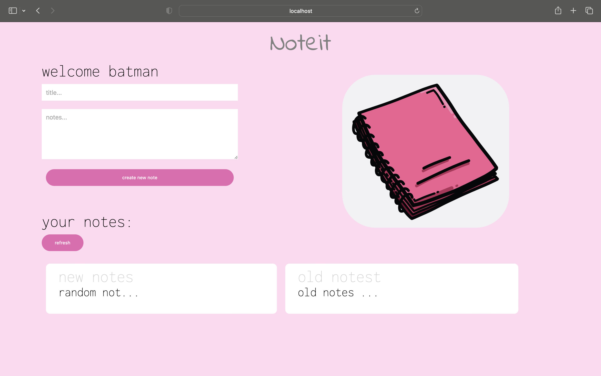

# Note-it

used MERN stack - this is a notes taking web application with proper authentication

</img>

So for auth purpose i used 
> jwt(JSON web tokens).

For backend
> Node js and Express js

For frontend
> React JS

For Database
> MongoDB


To Run the project
Open frontend and server folder in different directory
use
```
npm install
```
And 
```
npm start
```

project will be live in
https://localhost:3000
